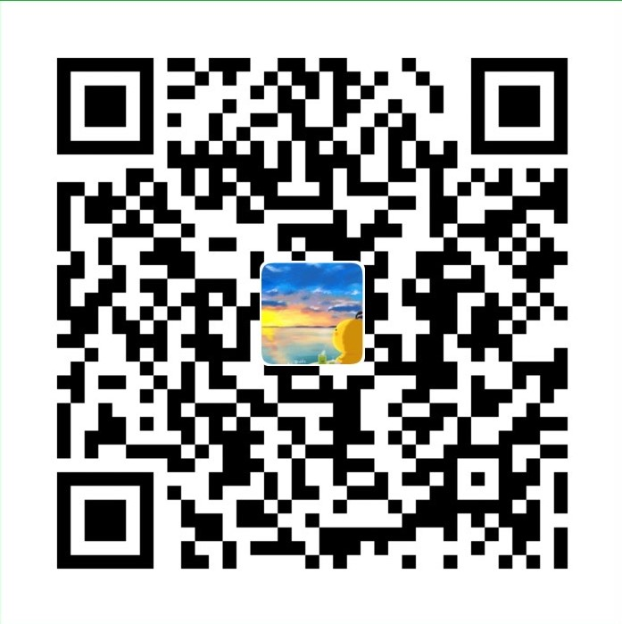

# :bookmark: VuePress 搭建个人静态博客网站

## :car: 环境

- VuePress
- Node 8+
- Yarn
  基于VuePress搭建的个人网站，享受 Vue + webpack 的开发体验。

## 简述

A simple and beautiful vuepress Blog & Doc theme.

## :star: Find Me

:smile: [海边的小溪鱼个人网站](https://www.gaosanshi.top/)

:email: 1130122701@qq.com

## 说明

> VuePress 搭建个人博客源码仓库

## 如果觉得文章不错，请我吃颗棒棒糖吧~~

