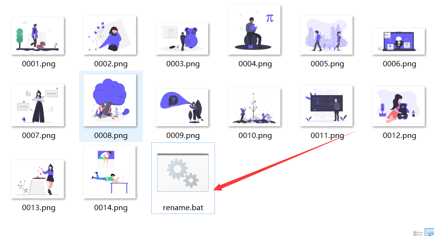

## 批量处理图片重命名

重命名的图片路径下新建一个`txt`文档，将下述代码复制，然后保存为`bat`文件（将`.txt`后缀改为`.bat`）,双击即可

```bash
@echo off
setlocal enabledelayedexpansion
set count=10000
for /f "delims=" %%i in ('dir /b *.jpg,*.png,*.bmp,*.jpeg,*.gif') do call:Rename "%%~i"
pause
exit
:Rename
set /a count+=1
if /i "%~1"=="!count:~1!%~x1" goto :eof
if exist "!count:~1!%~x1" goto Rename
echo  重命名：%1 !count:~1!
ren "%~1" "!count:~1!%~x1"
goto :eof
```

## 效果


